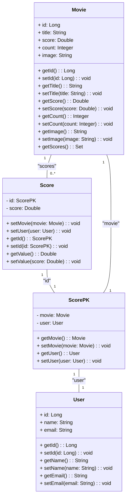

# DIO - Publicando Sua API REST na Nuvem Usando Spring Boot 3, Java 17 e Railway
www.dio.me

## Diagrama de classes

```mermaid

classDiagram
    class Movie {
        + id: Long
        + title: String
        + score: Double
        + count: Integer
        + image: String

        + getId(): Long
        + setId(id: Long): void
        + getTitle(): String
        + setTitle(title: String): void
        + getScore(): Double
        + setScore(score: Double): void
        + getCount(): Integer
        + setCount(count: Integer): void
        + getImage(): String
        + setImage(image: String): void
        + getScores(): Set<Score>
    }

    class Score {
        - id: ScorePK
        - score: Double
   
        + setMovie(movie: Movie): void
        + setUser(user: User): void
        + getId(): ScorePK
        + setId(id: ScorePK): void
        + getValue(): Double
        + setValue(score: Double): void
    }

    class ScorePK {
        - movie: Movie
        - user: User

        + getMovie(): Movie
        + setMovie(movie: Movie): void
        + getUser(): User
        + setUser(user: User): void
    }

    class User {
        + id: Long
        + name: String
        + email: String
 
        + getId(): Long
        + setId(id: Long): void
        + getName(): String
        + setName(name: String): void
        + getEmail(): String
        + setEmail(email: String): void
    }

    Movie "1" -- "0..*" Score : "scores"
    Score "1" -- "1" ScorePK : "id"
    ScorePK "1" -- "1" Movie : "movie"
    ScorePK "1" -- "1" User : "user"

  
```

